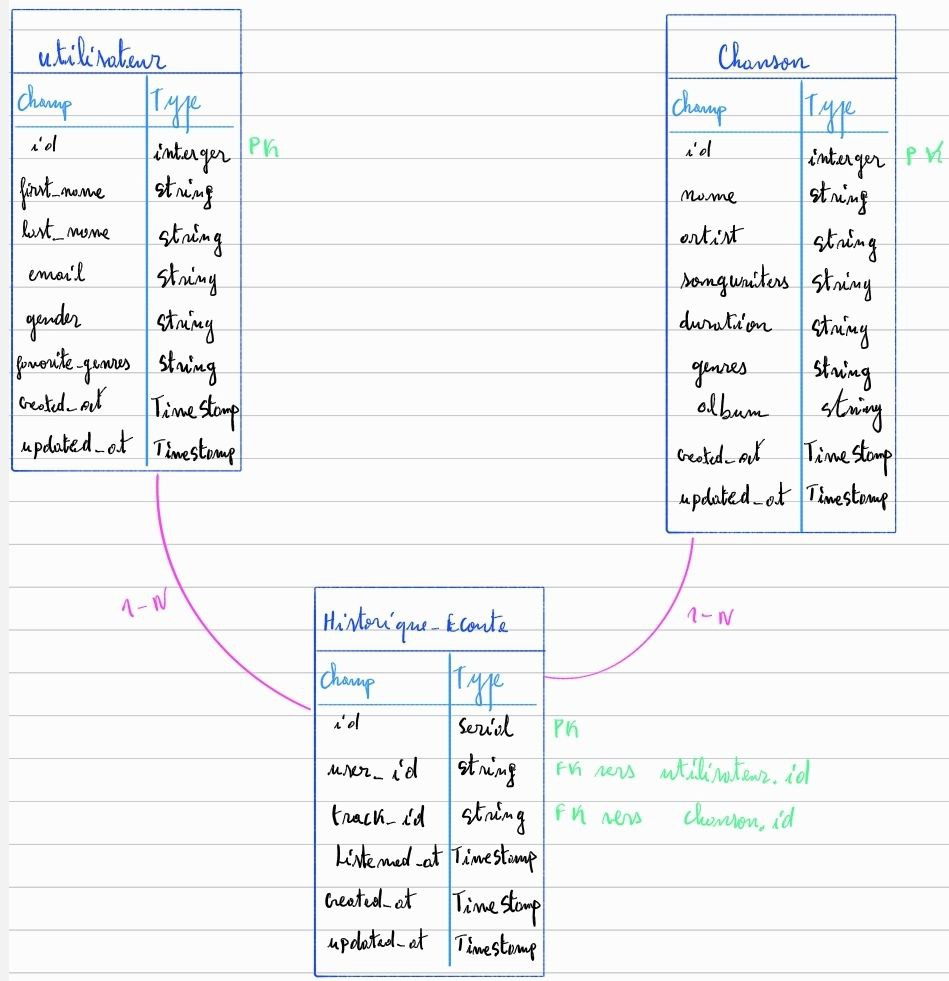

# Réponses du test

## _Utilisation de la solution (étape 1 à 3)_

Voici les différentes étapes à suivre pour utiliser la solution que j'ai implémentée. 

- Cloner le dépôt avec la commande git clone
- Créer un environment virtuel : python -m venv venv
- Activer l'environement virtuel : venv\Scripts\activate
- Installer les dépendances : pip install -r requirements.txt
- Lancer l'application : 
    cd src/moovitamix_fastapi
    python -m uvicorn main:app --reload
- Ouvrir dans le navigateur : http://127.0.0.1:8000/docs
- Lancer le pipeline de collecte des données que j'ai implémenté : 
    python src/moovitamix_fastapi/client_pipeline.py

Les fichiers JSON seront enregistrés dans le dossier /data.

Toutes les activités sont enregistrées dans le fichier data_pipeline.log.

Le fichier constants.py contient les constantes de configuration.

Si vous voulez modifier l'email pour l'envoi des notifications,
rendez vous dasn le fichier de constantes et modifiez : 

SMTP_USER = "tonadresse@gmail.com"
SMTP_PASSWORD = "ton_mot_de_passe_app"
DEST_EMAIL = "destination@gmail.com"

Lancer les tests unitaires
depuis la racine du projet : pytest

Pour la question 2, voici comment faire pour planifier quotidiennement le code fournie en utilisant le planificateur de tâches Windows : 

- Créer une tâche dans le planificateur de tâche Windows tout les jours à 3h par exemple.
- Mettre comme action à cette tâche le lancement de mon script en utilisant les chemins relatifs vers le dossier du projet.

## Questions (étapes 4 à 7)

### Étape 4

Pour stocker les données issues des endpoints `/tracks`, `/users` et `/listen_history`, je recommanderais l’utilisation d’une base de données relationnelle telle que PostgreSQL, pour sa robustesse, sa compatibilité avec des schémas structurés, ses performances sur des jointures complexes, et son évolutivité.

Plus spécifiquement on pourra avoir :

- Une structure claire pour les jointures 
- Une indexation avancée pour les requêtes complexes (Top des 10 chansons écoutées par un utilisateur)
- Supporte JSON pour les metadonnées flexibles (tag des chansons)
- Une réplication facile pour la haute disponibilité (ACID : Atomicité, Cohérence, Isolation, Durabilité)

MongoDB reste une bonne alternative si on a besoin de flexibilité sur les shémas mais est moins adaptée pour les jointures fréquentes.

Image faite sur ma tablette :



Les relations entre ces tables permettront de créer rapidement des vues pour les recommandations, les statistiques d’écoute, ou les profils utilisateurs.

Comme chaque entrée dans `listen_history` contient une liste d'IDs de morceaux, nous devons éclater chaque entrée en plusieurs lignes dans `Historique-Ecoute`.

### Étape 5

Afin d’assurer une exécution fiable et maintenable du pipeline au quotidien, je propose une approche de surveillance combinant : la journalisation structurée, la notification en cas d’échec et les indicateurs de performance (métriques).

Journalisation (`logging`)
   - Tous les événements critiques (succès, tentatives, erreurs) sont enregistrés dans un fichier `data_pipeline.log`.
   - Les niveaux de log (`INFO`, `WARNING`, `ERROR`) permettent de filtrer et diagnostiquer rapidement les anomalies.

Notifications automatiques en cas d’échec critique
   - En cas d’échec après plusieurs tentatives (`MAX_RETRIES`), une alerte peut être envoyée par courriel via `smtplib` (ou à terme par webhook Slack ou système d'alerte comme Sentry).

   Voici une photo d'un mail qui a réellement été envoyé en excecutant mon code : 

   

  NB : Pour des raisons de confidentialité j'ai retiré mes informations qui ont permis l'envoi de ce mail. Mais cela a été testé et marche.

Validation stricte des données avec Pydantic
   - Si les données récupérées sont mal formées ou incomplètes, une exception est levée et logguée.
   - Cela permet de bloquer silencieusement des corruptions de données en aval.

Planification et logs quotidiens
   - Exécution planifiée chaque jour à 3h avec redirection de la sortie standard vers un log.

Métriques clés à surveiller :

- Nombre de tentatives par endpoint : Indique la stabilité de l'API et la fiabilité du réseau 
- Nombre d'éléments reçus : Permet de détecter des anomalies dans les volumes (trop bas ou nul) 
- Taux de validation des données : Pourcentage d’éléments conformes au schéma Pydantic 
- Fichiers générés avec succès : Contrôle la présence des fichiers `tracks.json`, `users.json`, etc. 
- Temps d’exécution total : Permet de détecter une dégradation progressive des performances 
- Nombre de notifications envoyées : Indicateur de fréquence des erreurs critiques 

Évolutions possibles

À moyen terme, une intégration avec :
- Prometheus + Grafana (pour des dashboards de monitoring),
- Airflow (pour des DAG avec état d’exécution)
- Sentry / Datadog / NewRelic permettrait un suivi avancé.

Avec cette stratégie que je propose on garantit une bonne visibilité du fonctionnement du pipeline, une réaction rapide en cas d’erreur, et une traçabilité complète pour les audits ou l'amélioration continue.

### Étape 6

Pour automatiser le calcul quotidien des recommandations personnalisées, je propose un mini-pipeline dédié, orchestré par `cron` (ou un DAG Airflow à terme), qui s'exécute chaque nuit après l'ingestion des données.

Étapes du pipeline `generate_recommendations.py` :

1. Chargement des données
   - Lecture de `users.json`, `tracks.json`, `listen_history.json`.

2. Transformation
   - Création d'une matrice user-track (ex : table user → [track_ids])
   - Calcul de la fréquence, de la récence, ou de la similarité entre utilisateurs (collaboratif).

3. Algorithme de recommandation
   - Approche simple : fréquence d'écoute par genre/artiste
   - Ou approche avancée : cosine similarity, clustering, KNN

4. Génération
   - Recommandations = top N morceaux non encore écoutés
   - Export au format `recommendations.json` :
     ```json
     {
       "user_id": 123,
       "recommended_track_ids": [58293, 92382, 10324]
     }
     ```

5. Log et monitoring
   - Écriture dans `reco_pipeline.log`
   - Notification si aucun résultat généré ou si N < seuil

### Étape 7

Il faudra planifier le réentrainement hebdomadairement (ou mensuellement selon le volume) car c'est lourd.

On peut faire un pipeline retrain_model.py orchestré avec Airflow ou Prefect :

Extraction des données

    - Lecture des historiques d'écoute (écoutes brutes)

    - Nettoyage et normalisation

Préparation des features

    - Matrice user-item : interaction explicite (écoute) ou implicite (temps)

    - Encodage des utilisateurs et des morceaux

Entraînement

    - Utilisation d’un algorithme :

        - ALS (Alternating Least Squares)

        - LightFM

        - Neural Collaborative Filtering

    - Validation croisée

    - Évaluation : Recall@K, MAP, RMSE

Validation

    - Comparaison des performances avec l’ancien modèle

    - Acceptation ou rejet du modèle

Déploiement

    - Sauvegarde du modèle (.pkl ou format ONNX)

    - Mise à jour du modèle dans l’infrastructure (API, reco engine)

Notification

    - Résumé envoyé à l’équipe (mail ou Slack)

    - Log détaillé dans retrain_model.log


